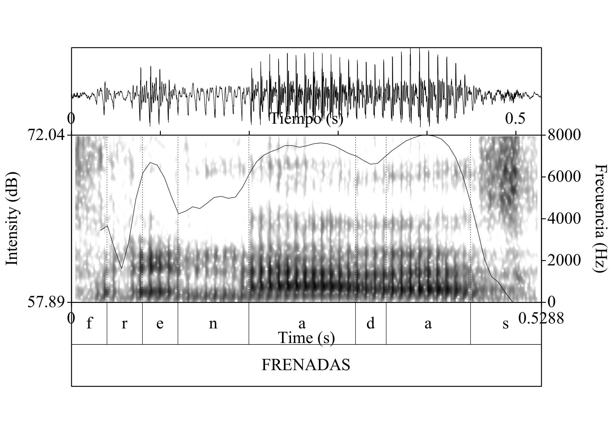
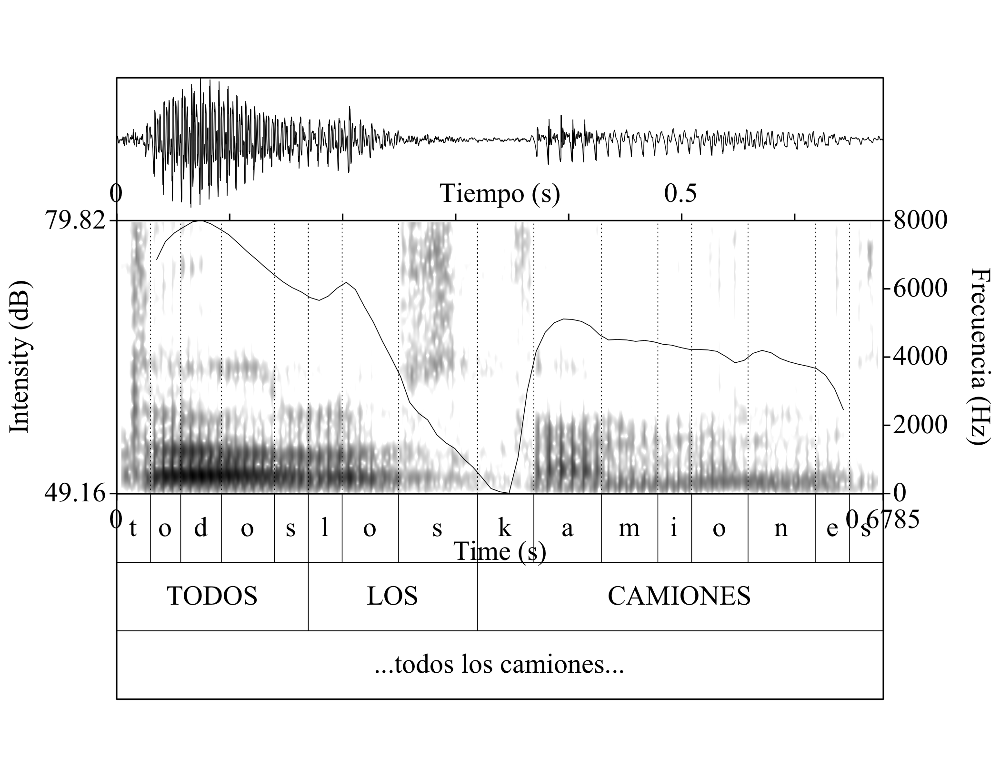

```{r setup, include=FALSE}
options(htmltools.dir.version = FALSE)
```

```{r, load_refs, echo=FALSE, cache=FALSE}
BibOptions(check.entries = FALSE, 
           bib.style = "authoryear", 
           cite.style = 'authoryear', 
           style = "markdown",
           hyperlink = FALSE, 
           dashed = FALSE)
myBib <- ReadBib("/Users/maxcarey/Documents/tesis/Zotero.bib", check = FALSE)
```


background-image: url(iloveuraccent.jpg)

---

class: inverse, center, middle

# Corpus

---

# Tabla 1: Información sociodemográfica de los hablantes

--
```{r mostrar_tabla_hablantes, echo=FALSE}
kable(speakerSocialData) %>%
  kable_styling() %>%
  scroll_box(width = "100%", height = "250px")
```

- Datos recopilados durante el año académico 2017-2018
--

- Las entrevistas de los chihuahuenses vienen del COEM
--

- Varios autores han usado medidas relativas de intensidad: tanto restas `r Citep(myBib, 'eddington_what_2011')` `r Citep(myBib, 'simonet_lenition_2012')` como proporciones `r Citep(myBib, 'carrasco2012')` `r Citep(myBib, 'scrivner2016')`

---
class: inverse, center, middle

# Variable dependiente

---
#### Figura 1: Oscilograma, espectrograma, y contorno de intensidad de la palabra "frenada"
--

```{r, out.width = "100%", out.height="375px", echo=FALSE}

```
 <center>
 <audio controls>
  <source src="frenadas.wav" type="audio/wav">
Si estás viendo este mensaje, quiere decir que no puedes ver el audio, busca la versión html de este documento, por favor.
</audio>
</center>

- Valle de intensidad: 69.70 dB
--

- Pico de intensidad: 71.99 dB

--
- Índice de intensidad: 3.29 [(71.99 - 69.70) + 1)]

---
#### Figura 2: Oscilograma, espectrograma, y contorno de intensidad de la frase “todos los camiones” (cdmx-in-situ-m-31-lic)
--

```{r, out.width = "100%", out.height="375px", echo=FALSE}

```
 <center>
 <audio controls>
  <source src="todolcamiones.wav" type="audio/wav">
Si estás viendo este mensaje, quiere decir que no puedes ver el audio, busca la versión html de este documento, por favor.
</audio>
</center>

- No hay un valle de intensidad
--

- Se tomó ciertas medidas acústicas cualitativas (véase apéndice)
--

- Los *tokens* de la /d/ intervocálica entre 600 y 1500 segundos.
--

- Techo teórico de 1386 tokens (-209)
--

-**1177** *tokens* en total

---

class: inverse, center, middle

# Variables Sociolingüísticas

---
#### Tabla 2: Variables Sociales
```{r, echo=FALSE}
kable(variablesSociales)
```

<br>

#### Tabla 3: Variables Lingüísticas
```{r, echo=FALSE}
kable(variableLings)
```

---

class: inverse, center, middle

# Estadística descriptiva

---

class: inverse, center, middle

# Grupo dialectal

---
# Grupo dialectal

.pull-left[
#### Figura 3: Ploteos de intensidad de la variable dependiente por los tres grupos (todos juntos)
```{r, echo=FALSE, fig.height=6}
ggplot(dData, aes(x = intensityDif, fill = grupo)) +
  geom_density(alpha = .3)
```
--
]

.pull-right[

- 1.07 (más debilitamiento) para los chihuahuenses in-situ

- 1.21 (debilitamiento intermedio) para los chihuahuenses en la CDMX

- 1.99 (menos debilitamiento) para los de la Ciudad de México in-situ.
]
---

class: center

#### Figura 4: Ploteo de densidad de la variable dependiente del grupo CHI-EN-CDMX.

```{r, echo=FALSE}
# Get the distribution of just the experimental data and plot peaks
# https://stackoverflow.com/questions/53841391/what-is-the-best-way-to-calculate-and-display-peaks-of-a-ggplot2geom-density/53841854?noredirect=1#comment94532420_53841854 
# This is a nice work around to put a read dot on the peak, but it doesn't tell me what the peak is
p <- ggplot(dDataCHICDMX, aes(x = intensityDif)) + geom_density() + ggtitle("CHI-EN-CDMX")
pb <- ggplot_build(p)
p + stat_peaks(
  data = pb[['data']][[1]],
  aes(x = x, y = density),
  color = "red",
  size = 5,
  geom = "text",
  angle = 0,
  hjust = -0.3,
  # This allows me to ignore a third peak that is located around 15 or so
  ignore_threshold = .5
) +
  stat_peaks(data = pb[['data']][[1]],
  aes(x = x, y = density),
  color = "red",
  # This allows me to ignore a third peak that is located around 15 or so
  ignore_threshold = .5,
  size = 2)
```

---

class: inverse, center, middle

# Sexo

---

.pull-left[
#### Figura 5: Ploteo de densidad de la variable dependiente del grupo CHI-EN-CDMX.
```{r, echo=FALSE}
medianSexo <- aggregate(intensityDif ~  sexo + grupo, dData, median)

ggplot(dData, aes(y = intensityDif, fill = sexo, x = sexo)) +
  geom_boxplot() +
  facet_grid(~grupo) +
  scale_fill_manual(values=c("#19A0AA", "#F15F36")) +
  ggtitle("Distribution of dependent variable by sex") + theme(axis.text.x = element_blank(), axis.ticks.x = element_blank(), axis.title = element_blank()) +
  geom_text(data = medianSexo, aes(label = round(intensityDif, digits=2), y = intensityDif + 0.6))
```
]

.pull-right[

<br>
<br>
<br>

- Interpretación sociolingüística clásica:

- "For stable sociolinguistic variables, women show a lower rate of stigmatized variants and a higher rate of prestige variants than men" `r Citep(myBib, 'labov_principles_2006')`

- Interpretación de la tercera ola `r Citet(myBib, 'eckert_variation_2008-1')`

- Los hombres expresando rasgos: “relajado”, y “buena onda”;

- Mujeres podrían estar expresando identidades como “trabajadora” y “seria”.


]
---

class: inverse, center, middle

# Variables lingüísticas

---

class: inverse, center, middle

# Vocal previa y vocal siguiente

---

#### Tabla 4: Conteos y Porcentajes de la vocal previa por grupo dialectal
```{r, echo=FALSE}
kable(createTable(dData, "grupo", "preceding_phone"))
```

<br>

#### Tabla 5: Conteos y Porcentajes de la vocal previa por grupo dialectal
```{r, echo=FALSE}
kable(createTable(dData, "grupo", "following_phone"))
```
---

class: center

#### Figura 6: Ploteo de caja de la variable dependiente según la vocal previa y el grupo dialectal
```{r, echo=FALSE}
ggplot(dData, aes(y = intensityDif, x = preceding_phone, fill = preceding_phone)) +
  geom_boxplot() +
  ylab(expression(más_debilitamiento %<->% menos_debilitamiento)) +
  geom_text(data = medianPreceding_phone, aes(label = round(intensityDif, digits=2), y = intensityDif + 0.6)) + #ggtitle("Distribución de la variable dependiente según la vocal previa") +
 scale_fill_brewer(palette="Spectral") + facet_wrap(~ grupo)
```

---

class: center

#### Figura 7: Ploteo de caja de la variable dependiente según la vocal siguiente y el grupo dialectal
```{r echo=FALSE}
ggplot(dData, aes(y = intensityDif, x = following_phone, fill = following_phone)) +
  geom_boxplot() +
  ylab(expression(más_debilitamiento %<->% menos_debilitamiento)) +
  geom_text(data = medianFollowing_phone, aes(label = round(intensityDif, digits=2), y = intensityDif + 0.6)) +
# + ggtitle("Distribución de la variable dependiente según la vocal siguiente") +
 scale_fill_brewer(palette="Spectral") + facet_wrap(~ grupo)
```
---

class: center, inverse, middle

# Tonicidad

---

class: center

#### Figura 8: Ploteo de caja de la variable dependiente según la tonicidad y el grupo dialectal ”
```{r, echo=FALSE}
ggplot(dData, aes(y = intensityDif, x = stressStatus, fill = stressStatus)) +
  geom_boxplot() + ggtitle("Distribucioón de la variable dependiente por tonicidad") +
  ylab(expression(más_debilitamiento %<->% menos_debilitamiento)) +
facet_wrap(~ grupo) + geom_text(data = medianStress, aes(label = round(intensityDif, digits=2), y = intensityDif + 0.6)) + scale_fill_brewer(palette="OrRd")

```
---

class: center, inverse, middle

# Frecuencia de token

---

class: center

#### Figura 8: Diagramas de dipsersión de la variable dependiente y la frecuencia de token con una regresión lineal simple por grupo.
```{r, echo=FALSE}
# The Alpha value adds transparecy to each of the points on the scatter plot
# Since by default, ggplot2 stacks values on top of each other that are the same, this can misrepresent the data and we can see where this occurs with the darker data points.
my.formula <- y ~ x
dData %>%
  ggplot(aes(y = intensityDif, x = wordFrequency)) +
  geom_point(alpha = 0.5, position = position_jitter(w = .1, h = 0)) +
  geom_smooth(method = "lm", formula = my.formula) + facet_wrap(~ grupo) +
  # This comes from the gmisc package
  stat_poly_eq(formula = my.formula, aes(label = paste(..eq.label.., ..rr.label.., sep = "~~~")),parse = TRUE)
```
---

class: center, middle, inverse

# Hablante

---
class: center

#### Figura 9: Ploteos de caja de la variable dependiente por hablante (coloreado por grupo)
```{r, echo=FALSE}
ggplot(dData, aes(y = intensityDif, x = speaker, color = grupo)) +
  geom_boxplot() + # ggtitle("Distribution of dependent variable by speaker") +
  # Acortar las etiquetas de eje horizontal
  scale_x_discrete(labels = c('1f','2m','3f', '4m', '5f', '6m', '7f', '8m', '9m', '10f','11f','12m')) +
  ylab(expression(más_debilitamiento %<->% menos_debilitamiento))
```

---
class: center

#### Figura 10: Ploteos de densidad de la variable dependiente por hablante (coloreado por grupo)
```{r, echo=FALSE}
ggplot(dData, aes(x = intensityDif, color = grupo)) +
  geom_density() + facet_wrap(~ speaker) + ggtitle("Distribution of dependent variable by speaker") +
  # Acortar las etiquetas de eje horizontal
  scale_x_discrete(labels = c('1f','2m','3f', '4m', '5f', '6m', '7f', '8m', '9m', '10f','11f','12m'))
```

---

class: center, middle, inverse

# Ítem léxico

---

#### Figuras 11: Nube de palabra de los ítems léxicos del grupo CHI-IN-SITU
```{r, echo=FALSE}
# To have these be saved into a word documnet check out the following post:
# https://stackoverflow.com/questions/47850921/is-there-any-way-to-show-a-wordcloud2-in-rmarkdown-as-a-pdf-or-word-file
wordCloudDataOne <- dDataCHISITU %>%
  select(Word) %>%
  group_by(Word) %>%
  count(Word) %>%
  arrange(desc(n))

wordcloud2(wordCloudDataOne)
```
---

#### Figuras 12: Nube de palabra de los ítems léxicos del grupo CHI-EN-CDMX
```{r, echo=FALSE}
wordClouDataTwo <- dDataCHICDMX %>%
  select(Word) %>%
  group_by(Word) %>%
  count(Word) %>%
  arrange(desc(n))
wordcloud2(wordClouDataTwo, size = .75)
```
---
#### Figuras 13: Nube de palabra de los ítems léxicos del grupo CDMX-IN-SITU
```{r, echo=FALSE}
wordCloudDataThree <- dDataCDMXSITU %>%
  select(Word) %>%
  group_by(Word) %>%
  count(Word) %>%
  arrange(desc(n))
wordcloud2(wordCloudDataThree, size = .75)
```

---

# References

```{r, 'refs', results='asis', echo=FALSE}
PrintBibliography(myBib)
```

---
