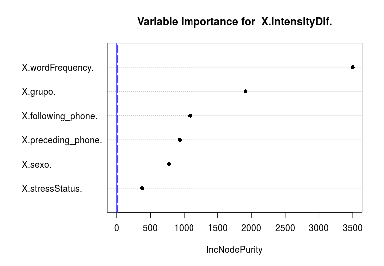

```{r setup, include=FALSE}
options(htmltools.dir.version = FALSE)
```

```{r, load_refs, echo=FALSE, cache=FALSE}
BibOptions(check.entries = FALSE, 
           bib.style = "authoryear", 
           cite.style = 'authoryear', 
           style = "markdown",
           hyperlink = FALSE, 
           dashed = FALSE)
myBib <- ReadBib("/Users/maxcarey/Documents/tesis/Zotero.bib", check = FALSE)
```

class: inverse, center, middle

# Introducción

---

## ¿Por qué contacto dialectal?

???

- El **tema central** de mi tesis es uno de **contacto dialectal** entre el español de **chihuahua** y el de **la CDMX**

--

- Interés personal

???

- Eligí este tema porque siempre me han fascinado las diferentes formas de hablar

--

- Interdialecto `r Citep(myBib, 'trudgill_dialects_1986')`

???

- Además, es sumamente interesante porque cunado uno aprende otro dialecto: se habla de forma diferente al D1 y al D2

--

- Parecido al estudio de adquisición de nuevas lenguas `r Citep(myBib, 'siegel_second_2010')`

???
### Quería empezar con algunas diferencias con la L2

- Parecida a la adquisición de segundas lenguas: se estudia la adquisición de nuevos sistemas lingüísticos.

- CD suele ser:
  
  - a. En contextos **naturales** en lugar del salón de clase
  
  - b. Bajo un enfoque sociolingüístico variacionista en lugar del aprendizaje de lenguas
  
  - c. En AL2, el aprendiz adquiere un sistema nuevo, la L2, y se mantiene la L1. En SDA, se modifica el primer dialecto y sigue siendo un solo sistema.
  
  - d. Depende del similitud entre los sistemas.

- Tenía pensando una serie de variables segmentales (debilitamiento vocálico) pero solo me voy a quedar con uno al final

- Me gustaría empezar con las preguntas de investigación

--

## Preguntas de investigación:

> 1a) ¿Cambia el habla de los chihuahuenses que vienen a vivir a la CDMX, una nueva zona dialectal? Si es así, ¿cómo cambia?

--

> 1b) ¿Acomodan sus rasgos fónicos a los de la variedad de la CDMX? ¿empiezan a producir variantes de la /d/ menos debilitadas?

--

> 1c) Si es así: ¿Cuáles son los factores sociales, lingüísticos e identitarios que condicionan esta variación?

---

class: inverse, center, middle

# Corpus

???

**Vamos a ver el corpus**

---

???

- Para poder contestar estas preguntas de investigación voy a tener tres corpus.

- 8-16-8 para el corpus entero

- 4-4-4 para el corpus piloto que es esta análisis

--

# Tabla 1: Información sociodemográfica de los hablantes
```{r mostrar_tabla_hablantes, echo=FALSE}
kable(speakerSocialData) %>%
  kable_styling() %>%
  scroll_box(width = "100%", height = "250px")
```

- Datos recopilados durante el año académico 2017-2018 en la Ciudad de México

- Las entrevistas de los chihuahuenses vienen del COEM (Butragueño, Mendoza, Orozco, en prep.)

???

- Todo tienen entre 20-40 años de edad

- Todos tienen estudios de licenciatura

- Todos son profesionistas, como lo son una grand porcentaje de chihuahuenses en la CDMX


---
class: inverse, center, middle

# Variable dependiente

--

- Medidas relativas de intensidad: restas `r Citep(myBib, 'eddington_what_2011')` `r Citep(myBib, 'simonet_lenition_2012')` proporciones `r Citep(myBib, 'carrasco2012')` `r Citep(myBib, 'scrivner2016')`

???

- La variable dependiente de este estudio no se basa en categorías discretas. Sino una medida acústica continua

---


#### Figura 1: Oscilograma, espectrograma, y contorno de intensidad de la palabra "frenadas" (cdmx-in-situ-m-31-lic)
--

```{r, out.width = "100%", out.height="375px", echo=FALSE}
knitr::include_graphics("frenadas.png")
```
 <center>
 <audio controls>
  <source src="frenadas.wav" type="audio/wav">
Si estás viendo este mensaje, quiere decir que no puedes ver el audio, busca la versión html de este documento, por favor.
</audio>
</center>

- Valle de intensidad: 69.70 dB
--

- Pico de intensidad: 71.99 dB

--
- Índice de debilitamiento: 3.29 [(71.99 - 69.70) + 1)]

---
#### Figura 2: Oscilograma, espectrograma, y contorno de intensidad de la frase “todos los camiones” (cdmx-in-situ-m-31-lic)
--

```{r, out.width = "100%", out.height="375px", echo=FALSE}
knitr::include_graphics("todolcamiones.png")
```
 <center>
 <audio controls>
  <source src="todolcamiones.wav" type="audio/wav">
Si estás viendo este mensaje, quiere decir que no puedes ver el audio, busca la versión html de este documento, por favor.
</audio>
</center>

- No hay un valle de intensidad
--

- Los *tokens* de la /d/ intervocálica entre 600 y 1500 segundos.
--

- Techo teórico de 1386 tokens (-209)
--

-**1177** *tokens* en total

---

class: inverse, center, middle

# Variables Sociolingüísticas

---
#### Tabla 2: Variables Sociales
```{r, echo=FALSE}
kable(variablesSociales)
```

<br>

#### Tabla 3: Variables Lingüísticas
```{r, echo=FALSE}
kable(variableLings)
```

???

- Nombrar cada variable, y explicar qué son

- Si tienen preguntas de por qué fueron codificados como son, me los pueden hacer al final

---

class: inverse, center, middle

# Estadística descriptiva

---

class: inverse, center, middle

# Grupo dialectal

---
# Grupo dialectal

.pull-left[
#### Figura 3: Ploteos de densidad de la variable dependiente por grupo dialectal
```{r, echo=FALSE, fig.height=8, fig.width=12}
ggplot(dData, aes(x = intensityDif, fill = grupo)) +
  geom_density(alpha = .3)
```
--
]

.pull-right[

- 1.07 (más debilitamiento) para los chihuahuenses in-situ

- 1.21 (debilitamiento intermedio) para los chihuahuenses en la CDMX

- 1.99 (menos debilitamiento) para los de la Ciudad de México in-situ.
]

???

1. Explicar los ejes de la figura
2. Estas figura muestra **claramente** que los tres **se comportan** de forma diferente con respeto al /d/ intervocálica
3. CHI-IN-SITU: Mucha concentración en valores bajos (muchas elisiones)
4. CDMX-IN-SITU, su distribución extiend hacia valores mucho más altos
5. El gurpo de inmigrantes (experimental), tiene una distribución bimodal
---

class: center

#### Figura 4: Ploteo de densidad de la variable dependiente del grupo CHI-EN-CDMX.

```{r, echo=FALSE}
# Get the distribution of just the experimental data and plot peaks
# https://stackoverflow.com/questions/53841391/what-is-the-best-way-to-calculate-and-display-peaks-of-a-ggplot2geom-density/53841854?noredirect=1#comment94532420_53841854 
# This is a nice work around to put a read dot on the peak, but it doesn't tell me what the peak is
p <- ggplot(dDataCHICDMX, aes(x = intensityDif)) + geom_density() + ggtitle("CHI-EN-CDMX")
pb <- ggplot_build(p)
p + stat_peaks(
  data = pb[['data']][[1]],
  aes(x = x, y = density),
  color = "red",
  size = 5,
  geom = "text",
  angle = 0,
  hjust = -0.3,
  # This allows me to ignore a third peak that is located around 15 or so
  ignore_threshold = .5
) +
  stat_peaks(data = pb[['data']][[1]],
  aes(x = x, y = density),
  color = "red",
  # This allows me to ignore a third peak that is located around 15 or so
  ignore_threshold = .5,
  size = 2)
```

???
- Tiene un segundo pico ubicado a 3.981 es decir representan tokens menos debilitados

---

class: inverse, center, middle

# Sexo

---

.pull-left[
#### Figura 5: Ploteo de densidad de la variable dependiente del grupo CHI-EN-CDMX.
```{r, echo=FALSE}
medianSexo <- aggregate(intensityDif ~  sexo + grupo, dData, median)

ggplot(dData, aes(y = intensityDif, fill = sexo, x = sexo)) +
  geom_boxplot() +
  facet_grid(~grupo) +
  scale_fill_manual(values=c("#19A0AA", "#F15F36")) +
  ggtitle("Distribution of dependent variable by sex") + theme(axis.text.x = element_blank(), axis.ticks.x = element_blank(), axis.title = element_blank()) +
  geom_text(data = medianSexo, aes(label = round(intensityDif, digits=2), y = intensityDif + 0.6))
```
]

.pull-right[

<br>
<br>
<br>

- Interpretación sociolingüística clásica:

- "For stable sociolinguistic variables, women show a lower rate of stigmatized variants and a higher rate of prestige variants than men" `r Citep(myBib, 'labov_principles_2006')`

- Interpretación de la tercera ola `r Citet(myBib, 'eckert_variation_2008-1')`

]

???

- Los hombres expresando rasgos: “relajado”, y “buena onda”;

- Mujeres podrían estar expresando identidades como “trabajadora” y “seria”.

- Para grupo CHI-EN-CDMX, podría ser que los hombres están resaltando sus identidades como "chihuahuens"

---

class: inverse, center, middle

# Variables lingüísticas

---

class: inverse, center, middle

# Vocal previa y vocal siguiente

---

class: center

#### Figura 6: Ploteo de caja de la variable dependiente según la vocal previa y el grupo dialectal
```{r, echo=FALSE}
ggplot(dData, aes(y = intensityDif, x = preceding_phone, fill = preceding_phone)) +
  geom_boxplot() +
  ylab(expression(más_debilitamiento %<->% menos_debilitamiento)) +
  geom_text(data = medianPreceding_phone, aes(label = round(intensityDif, digits=2), y = intensityDif + 0.6)) + #ggtitle("Distribución de la variable dependiente según la vocal previa") +
 scale_fill_brewer(palette="Spectral") + facet_wrap(~ grupo)
```

???
- Explicar la figura

- Las vocales altas tienden a tener realizaciones menos debilitadas

- Como son menos abiertos los gestos articulatorios tienen que viajar menos distancia para hacer una oclusión

---

class: center

#### Figura 7: Ploteo de caja de la variable dependiente según la vocal siguiente y el grupo dialectal
```{r echo=FALSE}
ggplot(dData, aes(y = intensityDif, x = following_phone, fill = following_phone)) +
  geom_boxplot() +
  ylab(expression(más_debilitamiento %<->% menos_debilitamiento)) +
  geom_text(data = medianFollowing_phone, aes(label = round(intensityDif, digits=2), y = intensityDif + 0.6)) +
# + ggtitle("Distribución de la variable dependiente según la vocal siguiente") +
 scale_fill_brewer(palette="Spectral") + facet_wrap(~ grupo)
```

???

- Quería mostrar que se observa el mismo patrón con las vocales siguientes

---

class: center, inverse, middle

# Tonicidad

---

class: center

#### Figura 8: Ploteo de caja de la variable dependiente según la tonicidad y el grupo dialectal ”
```{r, echo=FALSE}
ggplot(dData, aes(y = intensityDif, x = stressStatus, fill = stressStatus)) +
  geom_boxplot() + ggtitle("Distribucioón de la variable dependiente por tonicidad") +
  ylab(expression(más_debilitamiento %<->% menos_debilitamiento)) +
facet_wrap(~ grupo) + geom_text(data = medianStress, aes(label = round(intensityDif, digits=2), y = intensityDif + 0.6)) + scale_fill_brewer(palette="OrRd")

```

???

- Los *tokens* que vienen en sílabas tónicas suelen ser menos debilitados para los tres grupos dialectales

- Esto ha sido llamado "fortalecimiento prosódico", pero como veremos más adelante este factor no fue selecionado como estadísticamente significativo. (Carrasco, Simonet, Hualde, 155)

---

class: center, inverse, middle

# Frecuencia de token

---

class: center

.pull-left[
#### Figura 9: Nube de palabra de los ítems léxicos del grupo CHI-IN-SITU
```{r, echo=FALSE}
wordcloud2(wordCloudDataOne, shape="diamond")
```
]
.pull-right[
#### Tabla 7: Los ítems léxicos del grupo CHI-IN-CDMX
```{r echo=FALSE}
kable(wordCloudDataOne) %>%
  kable_styling() %>%
  scroll_box(width = "100%", height = "400px")
```
]
---
class: center

.pull-left[
#### Figuras 10: Nube de palabra de los ítems léxicos del grupo CHI-EN-CDMX
```{r, echo=FALSE}
wordClouDataTwo <- dDataCHICDMX %>%
  select(Word) %>%
  group_by(Word) %>%
  count(Word) %>%
  arrange(desc(n))
wordcloud2(wordClouDataTwo, shape="diamond")
```
]

.pull-right[
#### Tabla 8: Los ítems léxicos del grupo CHI-EN-CDMX con una frecuencia igual o mayor a tres
```{r, echo=FALSE}
kable(wordClouDataTwo) %>%
  kable_styling() %>%
  scroll_box(width = "100%", height = "400px")
```
]

???

- Es posible que las palabras conllevan pronunciaciones particulares, entonces quería mostrar cuáles eran las palabras más comunes para los tres grupos

- Son muy parecidos entre los tres grupos

- Los más comunes son "todo" y "nada", y "cada"

---

class: center

.pull-left[
#### Figura 11: Nube de palabra de los ítems léxicos del grupo CDMX-IN-SITU
```{r, echo=FALSE}
wordCloudDataThree <- dDataCDMXSITU %>%
  select(Word) %>%
  group_by(Word) %>%
  count(Word) %>%
  arrange(desc(n))
wordcloud2(wordCloudDataThree, shape="diamond")
```
]

.pull-right[
#### Tabla 9: Los ítems léxicos del grupo CHI-EN-CDMX con una frecuencia igual o mayor a tres
```{r echo=FALSE}
kable(wordCloudDataThree) %>%
  kable_styling() %>%
  scroll_box(width = "100%", height = "400px")
```
]

---

class: center

#### Figura 12: Diagramas de dipsersión de la variable dependiente y la frecuencia de token con una regresión lineal simple por grupo.
```{r, echo=FALSE}
# The Alpha value adds transparecy to each of the points on the scatter plot
# Since by default, ggplot2 stacks values on top of each other that are the same, this can misrepresent the data and we can see where this occurs with the darker data points.
my.formula <- y ~ x
dData %>%
  ggplot(aes(y = intensityDif, x = wordFrequency)) +
  geom_point(alpha = 0.5, position = position_jitter(w = .1, h = 0)) +
  geom_smooth(method = "lm", formula = my.formula) + facet_wrap(~ grupo) +
  # This comes from the gmisc package
  stat_poly_eq(formula = my.formula, aes(label = paste(..eq.label.., ..rr.label.., sep = "~~~")),parse = TRUE)
```

???

- Explicar el gráfico
- Explicar la regresión lineal
- Para todo los grupos dialectales, vemos una **relación negativa de moderada a fuerte**
- Es decir, los tokens de mayor frecuencia suelen ser más debilitados

---

class: center, middle, inverse

# Hablante

---
class: center

#### Figura 13: Ploteos de caja de la variable dependiente por hablante (coloreado por grupo)
```{r, echo=FALSE}
ggplot(dData, aes(y = intensityDif, x = speaker, color = grupo)) +
  geom_boxplot() + # ggtitle("Distribution of dependent variable by speaker") +
  # Acortar las etiquetas de eje horizontal
  scale_x_discrete(labels = c('1f','2m','3f', '4m', '5f', '6m', '7f', '8m', '9m', '10f','11f','12m')) +
  ylab(expression(más_debilitamiento %<->% menos_debilitamiento))
```

???

- Importante tomar en cuenta la varaición individual ya que no todos los hablantes se portan de la misma forma

- Puede ayudar a mostrar quienes son los inmigrantes que muestran o no acomodación

- Esta figura, por ejemplo, nos podría dar la impresión que los hablantes 5 y 8 son los únicos que acomodan al nuevo dialecto ya que sus distribuciones se enceuntren claramente encime de las demás personas

---
class: center

#### Figura 14: Ploteos de densidad de la variable dependiente por hablante (coloreado por grupo)
```{r, echo=FALSE}
ggplot(dData, aes(x = intensityDif, color = grupo)) +
  geom_density() + facet_wrap(~ speaker) + ggtitle("Distribution of dependent variable by speaker") +
  # Acortar las etiquetas de eje horizontal
  scale_x_discrete(labels = c('1f','2m','3f', '4m', '5f', '6m', '7f', '8m', '9m', '10f','11f','12m'))
```

???

- Esta figura indica que probablemente todos los chihuahuenses en la CDMX, en mayor o menor grado, se hanacomodado al habla local, pues la multimodalidad de sus distribuciones es mucho más evidente en comparacióncon los demás grupos

---

class: center, middle, inverse

# Estadística inferencial

???

- Voy a presentar los resultados del modelo de efectos mixtos

---

class: center, middle, inverse

# Método de efectos mixtos

???

- Los modelos de efectos mixtos son esencialmente regresiones lineales múltiples. Pero contienen factores aleatorios que ayudan a tomar en cuenta:

- (a) la naturaleza jerárquica de los datos (explicar)
- (b) La relación no sistemática de algunos factores con relación a la variable dependiente (explicar)

---
#### Tabla 10: Factores aleatorios del modelo lineal de efectos mixtos: ítem léxico y hablante<sup>1</sup>
```{r echo=FALSE}
kable(factores_aleatorios)
```

#### Tabla 11<sup>1</sup>: Factores fijos del modelo lineal de efectos mixtos
```{r, echo=FALSE}
kable(factores_fijos ) %>% kable_styling() %>% scroll_box(width = "100%", height = "225px")
```

<br>
<br>
.footnote[
[1] Modelos creados con Language Variation Suite `r Citep(myBib, 'scrivner2016')`)
]

???

- El 3.01 % de la variación en el modelo se debe a los ítems - 
-El 1 % se debe a los hablantes

- El 10 % de la variación es inexplicable (residual).

- vocalsiguiente=baja

- vocal siguiente=media

- vocal previa=media

- grupo=CHI-IN-SITU,frecuencia_de_token,grupo=CHI-EN-CDMX

- sexo=masculino.

- Observación de la gradación de las variables

---

class: center, inverse, middle

# Comentarios finales

---

- Los datos en este estudio reafirman las observaciones dialectales con respeto a la /d/ intervocálica en México `r Citep(myBib, 'lope_blanch_atlas_1992')`

???

- Enfatizar que es el primer trabajo que se basa en fonética acústica para estudiar el español de Chihuahua 

--

- Facilita el entendimiento de la /d/ intervocálica como un fenómeno continuo como se ha hecho en otros dialectos del español `r Citep(myBib, 'scrivner2016')`

???

- Muestra que no es una pura facilidad arituclatoria sino que hay diferencias dialectales entre estas dos regiones

--

## Las preguntas de investigación

> 1a) ¿Cambia el habla de los chihuahuenses que vienen a vivir a la CDMX, una nueva zona dialectal? Si es así, ¿cómo cambia?

> 1b) ¿Acomodan sus rasgos fónicos a los de la variedad de la CDMX? ¿empiezan a producir variantes de la /d/ menos debilitadas?

> 1c) Si es así: ¿Cuáles son los factores sociales, lingüísticos e identitarios que condicionan esta variación?

- Los datos muestran evidencia a favor de la acomodación dialectal, a "formas intermedias" (por una sola variable)


???

- En la adquisición de dialectos o segundas lenguas se ha hecho la distinción entre rasgos "implícitos", "explícitos"

- Creo que los hablantes inmigrantes no están concientes del debilitamiento de la /d/:
  a) Por lo menos, no como lo son con la /tS/

- Entonces es posible que están adquiriendo estos nuevos hábitos fónicos bajo el nivel de conciencia
  
  

---

# Referencias (1/2)
El reporte escrito se encuentra [Aquí](http://rpubs.com/axme100/piloto)


```{r, 'refs2', results='asis', echo=FALSE}
PrintBibliography(myBib, start = 1, end = 6)
```

---

# Referencias (2/2)

```{r, 'refs1', results='asis', echo=FALSE}
PrintBibliography(myBib, start = 7, end = 9)
```

---

background-image: url(iloveuraccent.jpg)

---

class: center, middle, inverse

# Métodos no paramétricos

---

.pull-left[
#### Figuras 14: Distribución de la variable dependiente (izquierda); distribución normal (derecha)
```{r echo=FALSE}
p1 <- ggplot(data = dData, aes(x = intensityDif)) + geom_density()
p2 <- ggplot(data = data.frame(x = c(-3, 3)), aes(x)) +
  stat_function(fun = dnorm, n = 101, args = list(mean = 0, sd = 1)) + ylab("")
grid.arrange(p1, p2, nrow = 1)
```
]

<br>
<br>
<br>

.pull-right[
- Los métodos no paramétricos no asumen que los datos siguen alguna distribución específica
`r Citep(myBib, 'baayen_analyzing_2008')` p.77

- Suelen ser muy útiles para analizar datos sociolingüísticos, ya que dichos datos tienden a ser desordenados entre y dentro de los individuos `r Citep(myBib, 'tagliamonte_variationist_2012')`

]

---

class: center, inverse, middle

# Bosques aletorios
---

#### Figuras 15: Bosque aleatorio generado con LVS, variables lingüísticas y sociales
```{r, out.width = "100%", out.height="375px", echo=FALSE}

```

---

class: center, inverse, middle

# Árbol de inferencia condicional

---

#### Figuras 16: Árbol de inferencia condicional con las variables lingüísticas y sociales juntas
```{r, echo=FALSE, message=FALSE, fig.width=18, fig.height=10}
# When using the partykit package the ctree function is loaded which produces a slightly different tree, but with the same heirarchy of variables, supposedly partykit is an enhancement of the party package.
# The benifit of using partykit is that you can control the size of the text so that people can actually read the tree
# http://r.789695.n4.nabble.com/ctree-party-changing-font-sizes-in-plots-td907947.html
library(partykit)
arbolTodo=ctree(dData$intensityDif~dData$preceding_phone+dData$following_phone+dData$stressStatus+dData$wordFrequency+dData$grupo+dData$sexo)
plot(arbolTodo, gp = gpar(fontsize = 20))
```
---

#### Figuras 17: Árbol de inferencia condicional con las variables sociales
```{r, echo=FALSE, fig.width=18, fig.height=10}
arbolSocial=ctree(dData$intensityDif~dData$grupo+dData$sexo)
plot(arbolSocial, gp = gpar(fontsize = 25))
```
---

#### Figuras 18: Árbol de inferencia condicional con las variables lingüísticas
```{r, echo=FALSE, fig.width=25, fig.height=12}
arbolLinguistico=ctree(dData$intensityDif~dData$preceding_phone+dData$following_phone+dData$stressStatus+dData$wordFrequency)
plot(arbolLinguistico, gp = gpar(fontsize = 25))
```


---

#### Tabla 4: Conteos y Porcentajes de la vocal previa por grupo dialectal
```{r, echo=FALSE}
kable(createTable(dData, "grupo", "preceding_phone"))
```

<br>

#### Tabla 5: Conteos y Porcentajes de la vocal previa por grupo dialectal
```{r, echo=FALSE}
kable(createTable(dData, "grupo", "following_phone"))
```